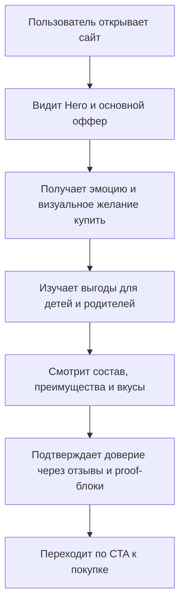

## 1. Обзор продукта
Премиальный mobile-first D2C сайт для бренда Tiggi Kids Chocolate, который превращает текущий каталог в эмоциональный, конверсионный и визуально выдающийся digital-флагман.
- Цель продукта: резко повысить доверие родителей, желание детей попробовать продукт и готовность купить уже с первого экрана.
- Рыночная ценность: позиционировать Tiggi как современный premium-playful бренд детского шоколада, который выглядит дороже категории и конкурирует не ценой, а восприятием, историей и качеством опыта.

## 2. Ключевые функции

### 2.1 Роли пользователей
Для MVP разделение по ролям не требуется.

### 2.2 Функциональные модули
1. **Главная страница**: hero-секция, storytelling, преимущества, вкусы, ингредиенты, социальное доказательство, FAQ, CTA, футер.
2. **Системные SEO-маршруты**: `sitemap.xml`, `robots.txt`, `manifest.webmanifest`, Open Graph image.

### 2.3 Детализация страниц
| Название страницы | Название модуля | Описание функции |
|---|---|---|
| Главная | Hero | Крупный продукт, 3D-иллюзия, floating шоколадки, мгновенный оффер, CTA "Купить сейчас" и CTA "Узнать больше", параллакс и мягкий reveal при прокрутке |
| Главная | Навигация | Липкая mobile-first навигация с быстрыми якорями по секциям, CTA покупки и аккуратным blur/glass эффектом |
| Главная | Почему дети обожают Tiggi | Яркие карточки с выгодами для ребенка, playful-иконки, микроанимации и эмоциональные формулировки |
| Главная | Почему родители выбирают Tiggi | Блок доверия с акцентом на натуральные ингредиенты, удобный формат, витамины D3, омега 3 и замену сахара на кокосовый |
| Главная | Состав и преимущества | Интерактивные ingredient cards, короткие объяснения пользы, бейджи качества и визуальные маркеры пользы |
| Главная | Галерея продукта | Masonry layout, touch-friendly слайдер, lightbox, drag/swipe жесты и product-in-context изображения |
| Главная | Вкусы | Премиальные flavor cards с кратким описанием, текстурным фоном, визуальным кодированием вкусов и CTA |
| Главная | История бренда | Scrollytelling-блок о философии Tiggi, натуральности, энергии, радости и современном взгляде на детский перекус |
| Главная | Социальное доказательство | Рейтинги, пользовательские сценарии, фотоформат lifestyle, trust metrics и короткие proof-statements |
| Главная | Отзывы | Карусель отзывов родителей, highlight цитаты, оценка, имя/город, сценарии использования |
| Главная | FAQ | Быстрые ответы на вопросы о составе, возрасте, формате, доставке и различии вкусов |
| Главная | Финальная CTA-секция | Повторный эмоциональный оффер, закрепление ценности и сильная кнопка перехода к покупке |
| Главная | Футер | Контакты, политика, юридическая информация, соцсети, быстрые ссылки и SEO-семантика |

## 3. Ключевой пользовательский поток
Главный поток строится вокруг одной короткой воронки: пользователь приходит с рекламы, поиска или соцсетей, мгновенно понимает ценность бренда в hero-блоке, прокручивает вниз ради доказательств доверия и пользы, видит продукт в контексте использования, получает ответы на сомнения и переходит к покупке.

Для родителей интерфейс должен снять три барьера: "это безопасно?", "это правда удобно?", "почему именно этот шоколад?". Для детей визуал должен создавать сильное желание попробовать продукт через форму, цвет, анимацию и аппетитную подачу.

## 4. Дизайн интерфейса
### 4.1 Стиль дизайна
- Дизайн-направление: Premium Playful Luxury.
- Бренд-микс: Apple x LEGO x Kinder x Nike x Stripe x Duolingo.
- Основные цвета: темный шоколад, карамель, молочный крем, теплый бежевый, акцентный мандариново-ягодный тон.
- Кнопки: крупные, округлые, с премиальной глубиной, мягкой тенью, магнитным hover-эффектом и стеклянными/градиентными вариациями.
- Типографика: выразительный display-шрифт с детским, но премиальным характером плюс спокойный современный гротеск для текста.
- Компоновка: mobile-first, layered-card композиция, асимметричные блоки, крупные медиазоны, controlled overlap.
- Иконки: мягкие, тактильные, с ощущением продуктового premium UI, без мультяшной дешевизны.
- Материалы и эффекты: glassmorphism, soft shadows, liquid shapes, mesh gradients, subtle noise, creamy highlights.

### 4.2 Обзор дизайна страниц
| Название страницы | Название модуля | UI-элементы |
|---|---|---|
| Главная | Hero | Полноэкранный продукт, глубина через слои, floating элементы, яркая типографика, крупные CTA, scroll cue |
| Главная | Преимущества | Premium cards, иконки, micro-motion, hover glow, stagger reveal |
| Главная | Галерея | Masonry grid, touch slider, полноэкранный lightbox, drag feedback, закругленные медиакарточки |
| Главная | Вкусы | Карточки вкусов с цветокодом, текстурными заливками, бейджами и быстрым CTA |
| Главная | Социальное доказательство | Рейтинг, UGC-style фото, badge cluster, proof metrics, review highlights |
| Главная | FAQ и CTA | Аккордеон с четкой иерархией, чистый фон, последний блок высокой конверсии |

### 4.3 Адаптивность
- Подход: mobile-first, затем масштабирование до tablet и desktop.
- На мобильных устройствах ключевые CTA находятся в зоне большого пальца, карточки занимают почти всю ширину, тексты укорочены, анимации оптимизированы под производительность.
- На десктопе усиливаются параллакс, layered composition и иммерсивность, но без ухудшения скорости.
- Минимальный размер интерактивных зон: 44x44px.
- Критические действия должны быть доступны одной рукой на экранах 375-430px.

### 4.4 Руководство по псевдо-3D сцене
- Окружение и настроение: теплое, аппетитное, солнечное, с ощущением дорогого lifestyle-packaging.
- Свет: мягкий студийный свет с карамельными бликами и контрастом на шоколадной поверхности.
- Камера: крупный план продукта в hero, мягкий dolly/parallax-эффект при скролле, акцент на упаковке и кусочках шоколада.
- Композиция: центральный продукт, плавающие мини-плитки, крошки какао, жидкие формы и слой текстуры позади.
- Взаимодействия: floating loops, subtle tilt, scale-on-scroll, reveal of benefits, hover physics на CTA.
- Постобработка: блюр стекла, мягкие тени, световой glow, grain overlay в малой интенсивности.
- Источники ассетов: сгенерированные заглушки через text-to-image API и иконографика SVG.
- Бюджет производительности: hero-анимации должны деградировать gracefully при `prefers-reduced-motion` и не ломать LCP.
