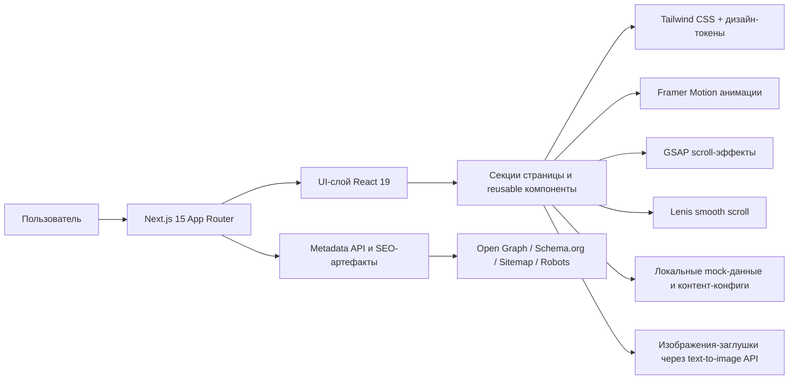
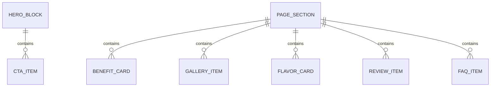

## 1. Архитектурный дизайн


## 2. Описание технологий
- Фронтенд: `Next.js 15` + `React 19` + `TypeScript 5`.
- Стилизация: `Tailwind CSS` с CSS-переменными и кастомными дизайн-токенами.
- Компонентный слой: `shadcn/ui` + `Radix UI`.
- Анимации: `Framer Motion` для входов, переходов и UI-моментов; `GSAP` для scroll-driven сцен и параллакса.
- Плавный скролл: `Lenis`.
- Иконки: `Lucide Icons`.
- Инициализация проекта: `create-next-app`.
- Бэкенд: отсутствует в MVP, используется статический/SSR frontend без отдельного API-сервиса.
- Данные: локальные типизированные объекты и массивы в `src/data`.
- Изображения: `next/image`, remote patterns для text-to-image API, WebP/AVIF где возможно.

## 3. Определение маршрутов
| Маршрут | Назначение |
|---|---|
| `/` | Главная premium D2C-страница бренда Tiggi Kids Chocolate |
| `/robots.txt` | SEO-инструкции для поисковых роботов |
| `/sitemap.xml` | Карта сайта для индексации |
| `/manifest.webmanifest` | PWA-метаданные и иконки |
| `/opengraph-image` | Генерация OG-изображения для шаринга |
| `/twitter-image` | Генерация изображения для социальных превью |

## 4. Определение API
Отдельный backend API в MVP не нужен.

Контент, анимационные настройки и SEO-данные хранятся локально и типизируются на уровне frontend-кода.

```ts
export type Flavor = {
  id: string;
  title: string;
  subtitle: string;
  accent: string;
  description: string;
  benefits: string[];
  image: string;
};

export type Review = {
  id: string;
  author: string;
  city: string;
  rating: number;
  quote: string;
  highlight: string;
};

export type FaqItem = {
  id: string;
  question: string;
  answer: string;
};
```

## 5. Серверная схема
Отдельная серверная схема не требуется, так как проект строится на возможностях `Next.js App Router` и его встроенного рендеринга.

Используется смешанная модель:
- статический рендер для контентных секций и SEO-артефактов;
- клиентские компоненты только там, где нужны интерактивность, жесты, lightbox и motion;
- строгая граница между server components и client components ради производительности.

## 6. Модель данных
### 6.1 Определение модели данных


### 6.2 Контентная структура
```ts
export type SiteContent = {
  seo: {
    title: string;
    description: string;
    ogTitle: string;
    ogDescription: string;
  };
  hero: {
    badge: string;
    title: string;
    description: string;
    primaryCta: string;
    secondaryCta: string;
    stats: string[];
  };
  benefitsForKids: {
    title: string;
    items: { title: string; description: string; icon: string }[];
  };
  benefitsForParents: {
    title: string;
    items: { title: string; description: string; icon: string }[];
  };
  ingredients: {
    title: string;
    items: { title: string; description: string; badge: string }[];
  };
  gallery: {
    title: string;
    items: { id: string; alt: string; image: string; size: "sm" | "md" | "lg" }[];
  };
  flavors: Flavor[];
  reviews: Review[];
  faq: FaqItem[];
};
```

## 7. Структура каталогов
- `src/app`: App Router, layout, page, metadata assets.
- `src/components/layout`: header, footer, section shell, containers.
- `src/components/marketing`: hero, benefits, gallery, flavors, reviews, faq, cta.
- `src/components/ui`: premium button, glass panel, badge, cards, section heading.
- `src/components/animation`: reveal wrappers, parallax layers, magnetic button hooks.
- `src/data`: контент, SEO, mock-данные, конфиги анимаций.
- `src/lib`: utility-функции, classnames, media helpers, schema generators.
- `src/styles`: глобальные стили, токены, дополнительные animation utilities.
- `public`: статические иконки, маски, noise textures, fallback assets.

## 8. Инженерные принципы
- Mobile-first как основной принцип проектирования, а не адаптация после десктопа.
- LCP-изображение hero должно загружаться приоритетно через `next/image` и иметь фиксированную стратегию размеров.
- Анимации делятся на критические и декоративные; декоративные не должны блокировать интерактивность.
- Для `prefers-reduced-motion` используется отдельный режим без сложных parallax и floating-сцен.
- Семантика, контраст и порядок табуляции проектируются на уровне A11y 100.
- Компоненты должны быть независимыми, переиспользуемыми и типизированными без неявных зависимостей.

## 9. SEO и аналитическая готовность
- Использовать `generateMetadata` и Next Metadata API для title, description, Open Graph, Twitter Cards.
- Добавить `JSON-LD` для `Product`, `Brand`, `FAQPage`, `Organization`.
- Подготовить `robots.txt`, `sitemap.xml`, canonical и alt-тексты.
- Закладывать чистую структуру для последующего подключения аналитики, пикселей и Shopify checkout-ссылок без переписывания layout.
